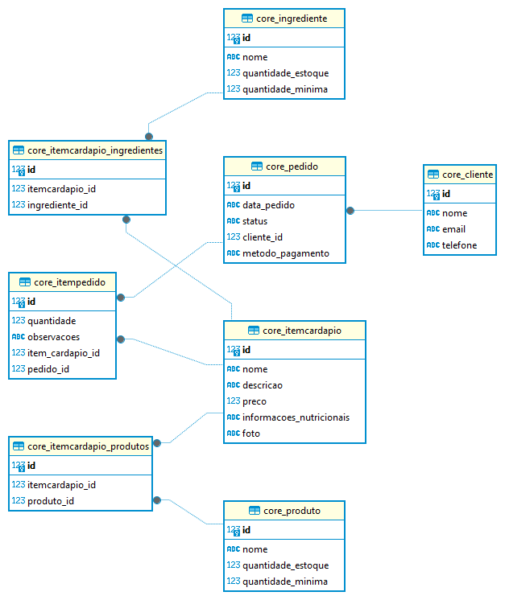

# Desafio SalaryFits - Sistema de Gestão de Cafeteria

Este é um projeto desenvolvido utilizando o framework Django  para gerenciar clientes, cardápio, pedidos, estoque e relatório.

## 🚀 Pré-requisitos

Esse projeto foi desenvolvido com as seguintes tecnologias:

- Python==3.12
- Django==5.0.6
- pandas==2.2.2
- pillow==10.3.0
- fpdf2==2.7.9
- Sqlite

## 💻 Projeto

O SfCafe é um sistema de gestão de cafeteria, que contém as seguintes funcionalidades:

- Cadastro de clientes: Permitir o cadastro de novos clientes, armazenando seus dados pessoais (nome, email, telefone, etc.).
- Gerenciamento de cardápio: Cadastrar e editar os itens do cardápio, incluindo nome,
descrição, preço, ingredientes, fotos e informações nutricionais.
- Pedidos e pagamentos: Permitir aos clientes realizar pedidos através do sistema,
selecionando itens do cardápio, personalizando pedidos (quantidade, adições, etc.) e
escolhendo o método de pagamento (dinheiro, cartão, etc.).
- Controle de estoque: Monitorar o estoque de ingredientes e produtos, gerando alertas para
reposição quando necessário.
- Relatórios e análises: Gerar relatórios de vendas e consumo de produtos.

## 📋 Modelagem do projeto



## 💻 Configuração do Ambiente

1. Clone este repositório:
   ```bash
   git clone https://github.com/hidelrios/django-SfCafe
   cd django-SfCafe
   ```
2. Crie um ambiente virtual (opcional, mas recomendado):
   ```bash
   python -m venv venv
   source venv/bin/activate  # No Windows, use "venv\Scripts\activate"
   ```
3. Instale as dependências do projeto:
   ```bash
   pip install -r requirements.txt
   ```
4. Aplique as migrações do banco de dados:
   ```bash
   cd django-SfCafe
   python manage.py migrate
   python manage.py makemigrations
   python manage.py migrate
   ```
5. Crie um superuser:
   ```bash
   python manage.py createsuperuser
   ```
6. Inicie o servidor de desenvolvimento:
   ```bash
   python manage.py runserver
   ```
7. Acesse o projeto em http://localhost:8000/
